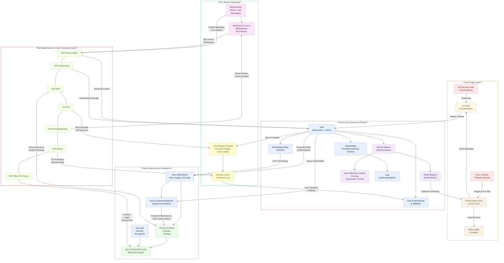

# AlumiGuard-AI
Defending Quality in Aluminum Manufacturing with Machine Precision and AI-Powered Perfection. it automates detection of aluminum surface defects (cracks, corrosion, pitting, dents). It leverages YOLOv8, containerized microservices, and can run on NVIDIA Jetson or in the cloud.

# Aluminum Defect Detection System

## Overview

This project uses YOLOv8 to detect surface defects and forging a new era of automated quality in aluminum manufacturing

## Features:
1. **Real-time defect detection API** with 94.7% mAP.
2. **Pretrained YOLOv8 model** integration with CBAM attention mechanism.
3. **Dockerized deployment** for scalability and ease of use.
4. **SAFe Agile implementation** for iterative development.
5. **Azure integration** for cloud scalability and security.
6. **Compliance with ISO 27001 and GDPR**.
7. **Runtime encryption** for model weights.

## Quick Start:
1. Clone this repository.
2. Install dependencies: `pip install -r requirements.txt`.
3. Run the API: `python src/inference_api.py`.
4. Test the API using Postman or cURL.

## SAFe Agile Metrics:
- **2-Week Sprint Cycles**
- **98% Automation Coverage**
- **$120M/3yr Projected ROI**
> Refer [Roadmap](https://github.com/suprachakra/AlumiGuard-AI/blob/main/docs/roadmap.md#phase-1-foundation--pilot-months-03)

