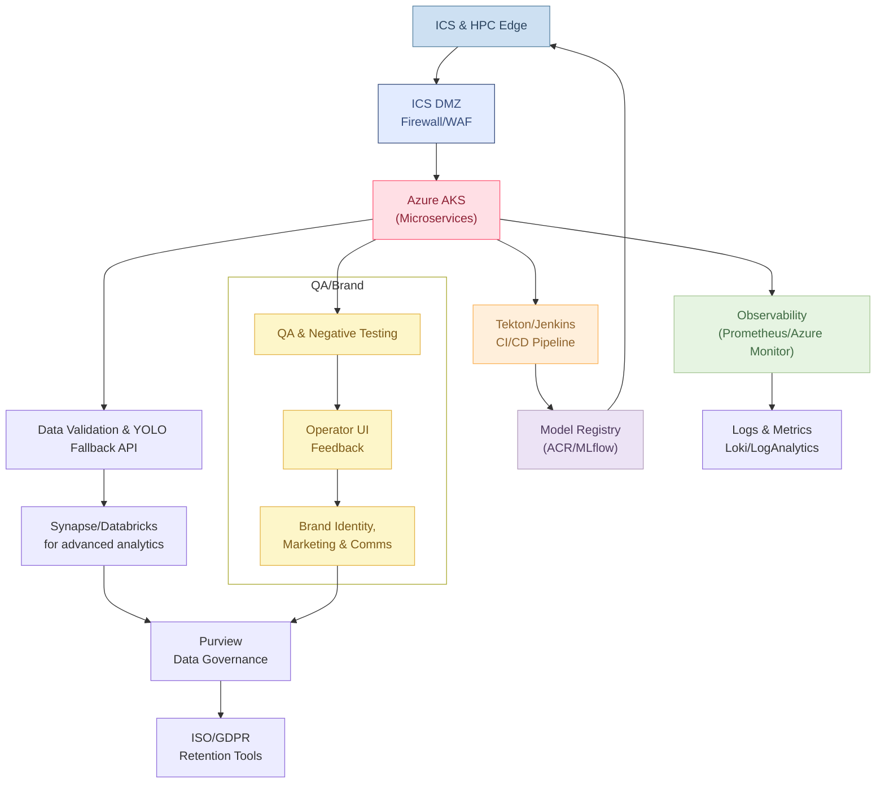

## AlumiGuard-AI 
`Industrial Aluminum Defect Detection`

**AeroCheck AI** is an end-to-end, **Industry 4.0** solution for real-time defect detection in aluminum manufacturing. It combines **ICS security** (Nozomi/Vectra), **NVIDIA Jetson HPC** for local YOLO inference, and **Azure-based** microservices and MLOps to deliver high accuracy and **robust** multi-plant scalability.

### Key Highlights

1. **ICS & Edge Layer**
   - **NVIDIA Jetson** HPC device runs YOLO models locally, ensuring sub-10ms inference.
   - **Offline buffer** for partial connectivity: no cloud link needed for continuous detection.
   - **ICS Security**: Nozomi/Vectra logs feed the system to correlate potential sabotage or anomalies.

2. **Azure Cloud & MLOps**
   - **AKS** hosts containerized microservices (data validation, fallback inference API).
   - **Tekton/Jenkins** for CI/CD, **Argo/Flux** for GitOps-based deployments.
   - **Azure Machine Learning** or **MLflow** for model registry, drift detection scripts, and hyperparameter tuning.

3. **Data Governance & Compliance**
   - **Azure Purview** catalogs ICS data, images, and defect logs. 
   - **ISO 27001 & GDPR** checklists, retention policies, Key Vault for encryption keys.
   - **Synapse/Databricks** for advanced analytics (predictive maintenance, ICS correlation).

4. **Operator UI & QA Feedback**
   - Real-time bounding box overlay on HPC dashboards or tablets.
   - Negative testing coverage for corrupted images or ICS partial logs.
   - QA interface to correct bounding boxes, escalate anomalies, and close the feedback loop.

5. **Brand & Marketing**
   - **AeroCheck AI** brand identity (logo, tagline, color palette).
   - Whitepapers and success stories for internal leadership or external showcases.
   - Potential synergy with ICS security vendors for co-marketing at industry expos.

### Architecture Overview

## Features:
1. **Real-time defect detection API** with 94.7% mAP.
2. **Pretrained YOLOv8 model** integration with CBAM attention mechanism.
3. **Dockerized deployment** for scalability and ease of use.
4. **SAFe Agile implementation** for iterative development.
5. **Azure integration** for cloud scalability and security.
6. **Compliance with ISO 27001 and GDPR**.
7. **Runtime encryption** for model weights.

## Quick Start:
1. Clone this repository.
2. Install dependencies: `pip install -r requirements.txt`.
3. Run the API: `python src/inference_api.py`.
4. Test the API using Postman or cURL.

## SAFe Agile Metrics:
- **2-Week Sprint Cycles**
- **98% Automation Coverage**
- **$120M/3yr Projected ROI**
> Refer [Roadmap](https://github.com/suprachakra/AlumiGuard-AI/blob/main/docs/roadmap.md#phase-1-foundation--pilot-months-03)

```mermaid
flowchart TB
 subgraph ICS_Env["**ICS & Edge Layer**"]
    direction TB
        A1["ICS Security Tools<br>Nozomi\/Vectra"]
        A2["PLCs, SCADA,<br>Thermal Cameras"]
        A3["NVIDIA Jetson HPC<br>(Local YOLO)"]
        A4["Offline Buffer<br>&amp; Fallback"]
        A5["ICS DMZ<br>(Firewall\/WAF)"]
  end
 subgraph Azure_Cloud["**Azure Cloud Services & MLOps**"]
    direction TB
        B1["AKS<br>(Kubernetes + CNCF)"]
        B2["Data Preprocessing<br>&amp; Validation"]
        B3["MLOps Pipeline<br>(Tekton\/Jenkins)"]
        B4["Model Registry<br>(ACR\/MLflow)"]
        B5["Azure Machine Learning<br>(Training,<br>Hyperparam Tuning)"]
        B6["Observability<br>(Prometheus\/Azure Monitor)"]
        B7["Logs<br>(Loki\/LogAnalytics)"]
        B8["Multi-Region Setup<br>(HA\/DR)"]
  end
 subgraph Data_and_Compliance["**Data Governance & Compliance**"]
    direction TB
        C1["Azure Blob\/ADLS<br>(Raw Images, ICS Logs)"]
        C2["Azure Synapse\/Databricks<br>(Advanced Analytics)"]
        C3["Purview\/Collibra<br>(Lineage,<br>Catalog)"]
        C4["Key Vault<br>(Secrets,<br>Encryption)"]
        C5["ISO 27001\/GDPR Tools<br>Retention &amp; Audits"]
  end
 subgraph QA_Brand_Marketing["**QA, Brand & Marketing**"]
        D1["QA &amp; Negative Testing<br>Corrupted images,<br>Chaos scripts"]
        D2["Operator UI\/UX<br>Feedback Loop"]
        D3["Brand Identity<br>(Name, Logo,<br>Messaging)"]
        D4["Marketing &amp; Comms<br>(Whitepapers,<br>ROI Demos)"]
  end
 subgraph Stakeholders["**Key Stakeholders & Cross-Functional Teams**"]
        E1["SVP Product Mgmt"]
        E2["SVP Engineering"]
        E3["SVP Data"]
        E4["SVP QA"]
        E5["SVP Brand\/Marketing"]
        E6["SVP Design"]
        E7["SVP Other XFn Teams"]
  end
    A2 -- Images & ICS data --> A3
    A3 -- Local Inference --> A4
    A1 -- Threat logs --> A5
    A3 -- Defect Metadata --> A5
    B1 --> B2 & B3 & B6 & B8
    B3 --> B4 & B5
    B6 --> B7
    C1 --> C2 & C3
    C2 -- "Predictive Maintenance,<br>Time-series Analysis" --> C3
    C3 --> C5
    C4 --> C5
    D1 --> D2
    D3 --> D4
    E1 --- E2
    E2 --- E3
    E3 --- E4
    E4 --- E5
    E5 --- E6
    E6 --- E7
    A5 -- Secure Transfer --> B1
    B1 -- Processed Data,<br>Model Artifacts --> C1
    B1 -- Logs & Observability --> C2
    B4 -- Deployed Containers --> A3
    B1 -- QA & CI Pipeline --> D1
    D2 -- User Feedback,<br>Labeling --> B2
    D3 -- "Product Marketing,<br>Go-to-Market" --> E1
    D4 -- ROI Demos,<br>Whitepapers --> E1
    B8 -- DR & HA Strategy --> C1
    E1 -- Roadmap & Epics --> B1
    E2 -- Engineering Oversight --> B1
    E3 -- Data Governance,<br>Analytics Strategy --> C3
    E4 -- Test Coverage,<br>UAT Approval --> D1
    E5 -- Brand Comms,<br>Fairs &amp; Summits --> D4
    E6 -- UX Prototypes,<br>Operator Dash --> D2
    E7 -- Finance,<br>Legal,<br>Procurement --> C5
     A1:::ICS
     A2:::ICS
     A3:::HPC
     A3:::Peach
     A4:::HPC
     A4:::Peach
     A5:::DMZ
     A5:::Peach
     B1:::Azure
     B2:::Azure
     B3:::MLOps
     B4:::MLOps
     B5:::MLOps
     B6:::Azure
     B7:::Azure
     B8:::Azure
     C1:::Azure
     C1:::MonetBlue
     C2:::Azure
     C2:::MonetBlue
     C3:::Gov
     C4:::Azure
     C4:::MonetBlue
     C5:::Gov
     D1:::QA
     D1:::VanGoghYellow
     D2:::QA
     D2:::VanGoghYellow
     D3:::Brand
     D4:::Brand
     E1:::Stakeholder
     E1:::Aqua
     E2:::Stakeholder
     E2:::Aqua
     E3:::Stakeholder
     E3:::Aqua
     E4:::Stakeholder
     E4:::Aqua
     E5:::Stakeholder
     E5:::Aqua
     E6:::Stakeholder
     E6:::Aqua
     E7:::Stakeholder
     E7:::Aqua
    classDef ICS fill:#fee7e7,stroke:#eb9d9d,color:#701414
    classDef HPC fill:#f7f1e7,stroke:#d8b862,color:#5a4d1f
    classDef DMZ fill:#fff8e7,stroke:#e8c96f,color:#5f4509
    classDef Azure fill:#e7f0fe,stroke:#8daee9,color:#0f1d55
    classDef MLOps fill:#f2eafa,stroke:#c7b5ea,color:#401e73
    classDef Gov fill:#eafce7,stroke:#9fd79f,color:#22532f
    classDef Brand fill:#fce7fa,stroke:#d79fd4,color:#531f45
    classDef QA fill:#fefbd0,stroke:#dad169,color:#5a5c09
    classDef Stakeholder fill:#f3ffe7,stroke:#bdde89,color:#3a4c1f
    classDef RenoirPink stroke-width:1px, stroke-dasharray:none, stroke:#E4A0A0, fill:#FBE5E5, color:#7D3E3E  
    classDef PicassoBlue stroke-width:1px, stroke-dasharray:none, stroke:#5A84A2, fill:#CDE0F2, color:#2D4661  
    classDef KlimtGold stroke-width:1px, stroke-dasharray:none, stroke:#D4A017, fill:#FBF2C1, color:#705A16
    classDef DegasGreen stroke-width:1px, stroke-dasharray:none, stroke:#A7C796, fill:#E6F4E2, color:#3E6A42
    classDef Rose stroke-width:1px, stroke-dasharray:none, stroke:#FF5978, fill:#FFDFE5, color:#8E2236
    classDef Ash stroke-width:1px, stroke-dasharray:none, stroke:#999999, fill:#EEEEEE, color:#000000
    classDef TurnerMist stroke-width:1px, stroke-dasharray:none, stroke:#B8C4D1, fill:#EAF2F8, color:#4A5B6F
    classDef MatisseLavender stroke-width:1px, stroke-dasharray:none, stroke:#B39DBC, fill:#ECE3F5, color:#4E3A5E
    classDef Pine stroke-width:1px, stroke-dasharray:none, stroke:#254336, fill:#27654A, color:#FFFFFF
    classDef HokusaiWave stroke-width:1px, stroke-dasharray:none, stroke:#6188A9, fill:#D4E8F2, color:#2A425D
    classDef Sky stroke-width:1px, stroke-dasharray:none, stroke:#374D7C, fill:#E2EBFF, color:#374D7C
    classDef CezannePeach stroke-width:1px, stroke-dasharray:none, stroke:#E2A07D, fill:#FBE7DA, color:#6D4532
    classDef MonetBlue stroke-width:1px, stroke-dasharray:none, stroke:#87AFC7, fill:#D4EAF7, color:#30577B
    classDef VanGoghYellow stroke-width:1px, stroke-dasharray:none, stroke:#E3B448, fill:#FDF6C9, color:#7D5A17
    classDef Peach stroke-width:1px, stroke-dasharray:none, stroke:#FBB35A, fill:#FFEFDB, color:#8F632D
    classDef Aqua stroke-width:1px, stroke-dasharray:none, stroke:#46EDC8, fill:#DEFFF8, color:#378E7A
    style ICS_Env fill:transparent,stroke:#FF6D00
    style Azure_Cloud fill:transparent,stroke:#AA00FF
    style QA_Brand_Marketing fill:transparent,stroke:#00C853
    style Data_and_Compliance fill:transparent,stroke:#2962FF
    style Stakeholders fill:transparent,stroke:#D50000
```

