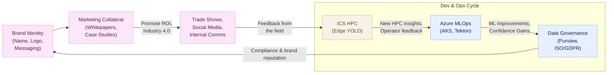

```mermaid
flowchart LR
    classDef Brand fill:#fce7fa,stroke:#d79fd4,color:#531f45
    classDef Dev fill:#e7f0fe,stroke:#8daee9,color:#0f1d55
    classDef ICS fill:#fee7e7,stroke:#eb9d9d,color:#701414
    classDef HPC fill:#f7f1e7,stroke:#d8b862,color:#5a4d1f

    A["Brand Identity<br>(Name, Logo,<br>Messaging)"]:::Brand --> B["Marketing Collateral<br>(Whitepapers,<br>Case Studies)"]:::Brand
    B -->|"Promote ROI,<br>Industry 4.0" | C["Trade Shows,<br>Social Media,<br>Internal Comms"]:::Brand

    subgraph DevCycle["Dev & Ops Cycle"]
      D["ICS HPC<br>(Edge YOLO)"]:::HPC
      E["Azure MLOps<br>(AKS, Tekton)"]:::Dev
      F["Data Governance<br>(Purview,<br>ISO/GDPR)"]:::Dev
    end

    C -->|"Feedback from<br>the field" | D
    D -->|"New HPC insights,<br>Operator feedback" | E
    E -->|"ML improvements,<br>Confidence Gains" | F
    F -->|"Compliance & brand reputation" | A
```
