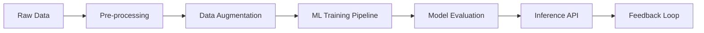

```mermaid
graph LR
    A[Raw Data] --> B[Pre-processing]
    B --> C[Data Augmentation]
    C --> D[ML Training Pipeline]
    D --> E[Model Evaluation]
    E --> F[Inference API]
    F --> G[Feedback Loop]
```
