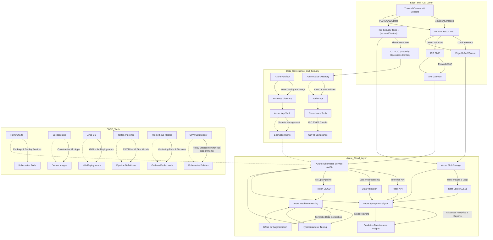

```mermaid
flowchart LR
    %% --- CLASS DEFINITIONS (Colors) ---
    classDef ICS fill:#fee7e7,stroke:#eb9d9d,color:#701414
    classDef HPC fill:#f7f1e7,stroke:#d8b862,color:#5a4d1f
    classDef DMZ fill:#fff8e7,stroke:#e8c96f,color:#5f4509
    classDef Azure fill:#e7f0fe,stroke:#8daee9,color:#0f1d55
    classDef MLOps fill:#f2eafa,stroke:#c7b5ea,color:#401e73
    classDef Gov fill:#eafce7,stroke:#9fd79f,color:#22532f
    classDef Reg fill:#e9fff7,stroke:#92c7bb,color:#0f4032
    classDef Observ fill:#fefbd0,stroke:#dad169,color:#5a5c09
    classDef Op fill:#f3ffe7,stroke:#bdde89,color:#3a4c1f
    classDef FlowStroke stroke-width:2px,stroke:#333

    %% --- ICS/OT ENVIRONMENT ---
    subgraph ICS["ICS / OT Environment"]
        A1["Nozomi or Vectra\n(ICS Security)"]:::ICS
        A2["PLCs, SCADA,\nCameras, etc."]:::ICS
        A1 --> A2
    end

    %% --- EDGE HPC ---
    subgraph Edge["Edge HPC / Jetson\n(Local YOLO)"]
        A3["Real-time YOLO Inference\n<10ms latency"]:::HPC
        A4["Offline Buffer & Failover\n(if cloud link down)"]:::HPC
        A3 --> A4
    end

    %% --- ICS DMZ ---
    subgraph DMZ["ICS DMZ / Firewall\n(Minimal Ports, Logging)"]
        A5["Strict Access Control\nWAF or Additional Firewalls"]:::DMZ
    end

    %% Connections among ICS, Edge, DMZ
    A2 -- "Images + ICS data":::FlowStroke --> Edge
    A1 -- "Security logs,\nthreat intel":::FlowStroke --> DMZ
    Edge --> DMZ

    %% --- AZURE SUBGRAPH ---
    subgraph AzureEnv["Azure Environment"]
        direction TB

        subgraph NW["Secure Ingress\n(Azure Firewall / WAF)"]
            A6["Validates JWT,\nRate Limits,\nTraffic Logging"]:::Azure
        end

        subgraph Landing["Azure Landing Zone\n(Blob / ADLS)"]
            B1["Raw images,\nICS logs,\nEdge data"]:::Azure
        end

        subgraph AKS["AKS Cluster\n+ CNCF Tools"]
            direction TB
            subgraph CI_CD["CI/CD & GitOps"]
                B2["Jenkins or Tekton\nBuildpacks, Helm"]:::Azure
                B3["Argo or Flux\n(Declarative Deploy)"]:::Azure
            end
            subgraph Microservices["Microservices"]
                B4["Data Validation\n& Preprocessing"]:::Azure
                B5["Inference API\n(Batch fallback)"]:::Azure
            end
            subgraph Observability["Observability"]
                B6["Azure Monitor,\nPrometheus\nfor metrics"]:::Observ
                B7["Logs to Loki or\nAzure Log Analytics"]:::Observ
            end
            subgraph MLPipe["MLOps Pipeline"]
                B8["train.py,\nDrift checks,\nJupyter/Kubeflow"]:::MLOps
                B9["MLflow or custom\ntracking"]:::MLOps
            end
            subgraph SecurityExtras["Security & Policy"]
                B10["OPA/Gatekeeper\n(optional)"]:::Azure
                B11["Azure Key Vault\n(secrets)"]:::Azure
            end
        end

        subgraph Governance["Data Governance\n(Purview / Collibra)"]
            C1["Data Catalog,\nLineage,\nCompliance"]:::Gov
        end

        subgraph Analytics["Advanced Analytics\n(Synapse / Databricks)"]
            C2["ETL, big data\nPredictive Maint,\nFeature Eng."]:::Gov
        end

        subgraph ModelRegistry["Model Registry\n(ACR / MLflow)"]
            D1["Versioned Container\nImages,\nModel Artifacts"]:::Reg
        end

        %% AZURE Connections
        A6 -- "Authorized traffic":::FlowStroke --> Landing
        Landing -- "New data triggers":::FlowStroke --> AKS
        AKS -- "Processed data,\nre-trained results":::FlowStroke --> Governance
        Governance --> C1
        C1 --> Analytics
        Analytics -->|"Train or clean insights"| AKS
        AKS -->|"Builds images":::FlowStroke| ModelRegistry
        ModelRegistry -->|"Pull containers":::FlowStroke| Edge
        ModelRegistry -->|"Cloud inference pods":::FlowStroke| AKS

    end

    %% Connection from DMZ to Azure Ingress
    DMZ -- "TLS or VPN":::FlowStroke --> A6

    %% FEEDBACK & OPERATOR UI
    subgraph Feedback["Feedback & Operator UI\n(SAFe Cross-Functional)"]
        E1["Operators, QA\nFlag missed defects,\nprovide new labels"]:::Op
        E2["Nozomi/Vectra ICS\nThreat Dash /\nSOC Alerts"]:::Op
    end

    %% Final connections
    E1 -->|"Annotations":::FlowStroke| AKS
    E2 -->|"Correlate ICS events":::FlowStroke| A1

    %% --- Overall Layout / Flow
    class Edge,DMZ,ICS,A1,A2,A3,A4,A5,A6,B1,B2,B3,B4,B5,B6,B7,B8,B9,B10,B11,C1,C2,D1,E1,E2 FlowStroke
```

# System Architecture

## Overview
AlumiGuard AI is split into three layers:

1. **Edge Layer**: Real-time inference on NVIDIA Jetson AGX
2. **Cloud Layer**: Model training & orchestration on Azure (AKS + ACR)
3. **Data Layer**: Central data store in Azure Blob, analytics in Azure Synapse


## Data Pipeline
1. **Data Ingestion**: Images come from smelter lines or QA stations.
2. **Preprocessing**: Resize, augment, label in `data/labels/`.
3. **Model Training**: Done on Azure ML or custom GPU setups.
4. **Drift Detection**: `scripts/data_drift_detection.py` weekly checks.
5. **Edge Deployment**: YOLO models pulled from container registry.


## Observability & Monitoring
- **Logging**: Centralized in Azure Monitor
- **Metrics**: GPU usage, inference latency
- **Alerting**: High error rates or unusual drift triggers ops notifications

## Monitoring & Alerting
- Integrate Azure Monitor or Datadog + Grafana
- Log ingestion: container logs => centralized platform
- Alerts: CPU usage > 80%, inference latency spike, sudden defect rate changes

## Technical Business Analysis & Translators

- **Business Needs Mapping**: We host regular sessions with product owners and domain experts to translate operational (OT) requirements into data & AI solutions.
- **Cross-Functional Coordination**: Technical business analysts facilitate communication between Data Science, IT/OT, and other stakeholders, ensuring consistent interpretation of business logic.
- **Documentation**: All discovered business logic is documented in an enterprise repository or architecture knowledge base, preventing misalignment.

## Solution Architecture Governance

- **Architecture Governance Board**: A team of architects oversees solution compliance with corporate standards, especially regarding IT/OT integration.
- **Blueprint & Roadmaps**: We maintain a “solution architecture blueprint” that evolves with new technologies or processes. 
- **Pre-Initiation Reviews**: All major projects pass an architecture checklist before starting, ensuring consistency and reducing system outages or mismatches.

## Cloud & Cost Management (FinOps)

- **Cloud Architecture**: Design scalable, secure solutions on Azure or multi-cloud. 
- **FinOps Collaboration**: We actively partner with FinOps to monitor usage, optimize compute/storage costs, and track ROI for each workload.
- **Application Performance Monitoring (APM)**: Performance metrics are aggregated in dashboards (Azure Monitor, Dynatrace, etc.) to quickly identify bottlenecks or cost overruns.

## Architecture
```
┌───────────────────────────┐
│          OT Layer          │
│ (Plant Floor / Smelters)   │
└────────────────────────────┘
     |                          ^
     | (Industrial protocols,   | (Monitoring ICS traffic)
     |  e.g., OPC UA / SCADA)   |  
     v                          |
┌────────────────────────────────────────────────────┐
│      Nozomi / Vectra ICS Security Monitoring       │
│   (Observes ICS network & detects anomalies)       │
│----------------------------------------------------│
│ - Monitors traffic from PLCs, cameras, edge nodes. │
│ - Sends alerts on suspicious ICS events, threats.  │
│ - Integrates with OT SIEM / security dashboards.   │
└────────────────────────────────────────────────────┘
     |  (Security telemetries,
     |   ICS events)
     v
┌────────────────────────────────────────────────────────────────┐
│                ICS DMZ / Network Segmentation                  │
│   (Strict firewall rules, bridging OT & IT with minimal ports) │
└────────────────────────────────────────────────────────────────┘
     |   (Secured traffic allowed to/from edge devices)
     v
┌─────────────────────────────────────────────────────────────┐
│               Edge Inference & Data Capture                 │
│ (Jetson devices, local HPC, Industry 4.0 sensors)           │
│-------------------------------------------------------------│
│ 1) Cameras capture live images of aluminum surfaces.        │
│ 2) Local YOLO-based container for real-time inference.      │
│ 3) Buffer or offline store data if comms fail.              │
│ 4) Potential direct feed to Nozomi / Vectra for ICS logs.   │
│ 5) Minimal data or aggregated insights transmitted          │
│    through ICS DMZ to Azure for advanced processing.        │
└─────────────────────────────────────────────────────────────┘
     |    (Encrypted, TLS, firewall whitelisted)
     v
┌───────────────────────────────────────────────────────────────────┐
│           Azure Ingress & Security (WAF / Gateway)                │
│        (Ensures only legitimate traffic flows into cloud)         │
│-------------------------------------------------------------------│
│ - May include API Management, Azure Firewall, or WAF in front.    │
│ - Validates JWT tokens, checks rate limits, logs suspicious calls.│
└───────────────────────────────────────────────────────────────────┘
     |    (Images, partial metadata, ICS logs, etc.)
     v
┌────────────────────────────────────────────────────────────────────────┐
│                         Azure Kubernetes Service (AKS)                 │
│  (Microservices for Inference API, MLOps pipelines, & Data Processing) │
│------------------------------------------------------------------------│
│ 1) **Inference API** (Flask-based, JWT-protected)                      │
│    - Receives images from edge or batch QA, triggers detection         │
│ 2) **Data Validation & Augmentation** (Python microservice)            │
│    - Normalizes data, applies synthetic defects, checks quality        │
│ 3) **MLOps Pipeline** (CI/CD)                                          │
│    - Data drift detection (weekly or real-time)                        │
│    - Automated training (train.py) & advanced analytics                │
│    - Integration with SAFe sprints (feature increments, epic tasks)    │
│ 4) **Nozomi/Vectra Bridge** (optional microservice)                    │
│    - Pull or push ICS security events to unify logging, anomaly data   │
│ 5) **Monitoring (Datadog/Grafana / Azure Monitor)**                 │
│    - Collects container metrics, logs performance, triggers alerts     │
└────────────────────────────────────────────────────────────────────────┘
     |    (Data flow for storage, analytics, logs)
     v
┌───────────────────────────────────────────────────────────────┐
│         Azure Blob/ADLS & Synapse / Databricks                │
│-------------------------------------------------------------- │
│ - Stores raw & preprocessed images (defect_labels.csv, etc.)  │
│ - Large-scale analytics (Synapse, Databricks) for advanced    │
│   Industry 4.0 use cases: predictive maintenance, anomaly     │
│   detection, etc.                                             │
│ - Data lineage & catalog via Purview (or Collibra)            │
│ - Integrates with MLOps pipeline for historical training data │
└───────────────────────────────────────────────────────────────┘
     |
     v
┌──────────────────────────────────────────────────────────────────┐
│        Data Governance & Security (Key Vault, ISO/GDPR)          │
│------------------------------------------------------------------│
│ - Key Vault for secret management (JWT keys, encryption keys).   │
│ - RBAC, compliance checks (ISO 27001, GDPR).                     │
│ - FinOps oversight (cost dashboards, resource optimization).     │
│ - Architecture governance for solution changes.                  │
└──────────────────────────────────────────────────────────────────┘
     |
     v
┌───────────────────────────────────────────────────────────────────────────────┐
│                User & Stakeholder Interfaces                                  │
│-------------------------------------------------------------------------------│
│ 1) **Operators & QA Dashboards**                                              │
│    - Real-time detection alerts from edge devices                             │
│    - Batch QA results (list of defects, severity, images)                     │
│    - ICS security notifications from Nozomi/Vectra if anomalies affect QA     │
│                                                                               │
│ 2) **Management Console**                                                     │
│    - Multi-plant global overview, defect trends, performance metrics          │
│    - Cost dashboards (FinOps), HPC usage, manufacturing throughput            │
│    - High-level ICS threat intelligence feed from Nozomi/Vectra               │
│                                                                               │
│ 3) **Data Scientist Workbench**                                               │
│    - Jupyter notebooks (e.g., notebooks/defect_detection.ipynb)               │
│    - Access to data for offline analysis, model retraining, advanced ML ops   │
│    - Integration with SAFe backlog items, PIs, epics                          │
│                                                                               │
│ 4) **Solution Architects & Cross-Functional Teams**                           │
│    - Detailed architecture governance, verifying compliance with ICS standards│
│    - Approvals of new expansions, multi-region deployment, or HPC scaling     │
│    - Collaboration for Industry 4.0 expansions and advanced synergy           │
└───────────────────────────────────────────────────────────────────────────────┘
```

## Data pipeline
```
┌─────────────────────────────────────────────┐
│         Cameras @ Smelter Lines (OT)        │
│   (Capturing aluminum surface images)       │
└─────────────────────────────────────────────┘
       |      
       | (Raw image data, ICS signals)       
       v      
┌──────────────────────────────────────────────────────────┐
│   Edge Inference & Collection (Jetson / HPC on OT side)  │
│----------------------------------------------------------│
│ 1) Real-time YOLO model for quick local detection        │
│ 2) Buffer storage if no cloud connectivity               │
│ 3) ICS data/alerts from PLC/SCADA monitored via          │
│    Nozomi/Vectra for ICS anomalies                       │
└──────────────────────────────────────────────────────────┘
       |  (Images + partial detection logs + ICS metadata)
       |  (Controlled ICS DMZ transfer / limited ports)
       v
┌───────────────────────────────────────────────────────────────────────┐
│            ICS DMZ (Network Segmentation / Security)                  │
│   - Ensures safe, minimal data transfer from OT to IT/Cloud           │
│   - Logs from Nozomi/Vectra forwarded if relevant to cloud analytics  │
└───────────────────────────────────────────────────────────────────────┘
       |
       v
┌────────────────────────────────────────────────────────────────┐
│        Ingestion Layer (Azure Gateway / Firewall / WAF)        │
│ - Receives data from edge, verifying auth (JWT, rate limiting) │
│ - Applies threat checks, logs suspicious activity              │
└────────────────────────────────────────────────────────────────┘
       |
       v
┌────────────────────────────────────────────────────────────────────────┐
│       Landing Zone (Azure Blob / ADLS)  --  Staging Area               │
│  - Raw images stored in a time-partitioned container/folder            │
│  - ICS logs or partial detection logs also stored for further analysis │
└────────────────────────────────────────────────────────────────────────┘
       |
       | (Data ingestion triggers or scheduled batch processes)
       v
┌──────────────────────────────────────────────────────────────────────────────┐
│      Data Preprocessing & Validation (AKS Microservices / Databricks)        │
│------------------------------------------------------------------------------│
│ 1) Resize images, remove corrupt files, unify format                         │
│ 2) Enrich with ICS metadata (e.g., line ID, shift, severity from edge)       │
│ 3) Data Validation Service checks columns, labeling accuracy (defect_labels) │
│ 4) Output stored in “Processed” zone of ADLS/Blob                            │
└──────────────────────────────────────────────────────────────────────────────┘
       |
       v
┌───────────────────────────────────────────────────────────────────────────┐
│          Data Governance & Cataloging (Purview / Collibra)                │
│---------------------------------------------------------------------------│
│ - Automated scanning of new data in processed zone                        │
│ - Assigns metadata: data lineage, classification (PII, confidential, etc.)│
│ - Ensures compliance with GDPR / ISO 27001, logs for audit trail          │
└───────────────────────────────────────────────────────────────────────────┘
       |
       | (Governed, curated data, with lineage & compliance tags)
       v
┌──────────────────────────────────────────────────────────────────────────────┐
│                  Feature Engineering & Analytics (Synapse / Databricks)      │
│------------------------------------------------------------------------------│
│ 1) Joins with historical defect data, production context, ICS logs           │
│ 2) Creates training-ready datasets (images + bounding boxes + context)       │
│ 3) Possibly merges advanced ICS threat intelligence from Vectra/Nozomi logs  │
│ 4) Outputs final feature sets to "analytics" or "gold" zone                  │
└──────────────────────────────────────────────────────────────────────────────┘
       |
       | (Clean, structured data for ML model training)
       v
┌────────────────────────────────────────────────────────────────────────┐
│              MLOps Pipeline (AKS, train.py, CI/CD)                     │
│------------------------------------------------------------------------│
│ 1) Model Training & Tuning                                             │
│    - YOLO-based or custom architecture, uses curated feature sets      │
│    - Hyperparameter sweeps, synthetic defect generation                │
│ 2) Model Validation & Testing                                          │
│    - Evaluates accuracy, precision, recall, F1                         │
│    - Compare performance vs. baseline (model registry)                 │
│ 3) Data/Concept Drift Detection                                        │
│    - scripts/data_drift_detection.py checks weekly or near real-time   │
│    - If drift exceeds threshold, triggers partial retraining           │
│ 4) CI/CD Integration                                                   │
│    - Automated pipeline merges new model only if QA & coverage pass    │
│ 5) Deployment to Edge & Cloud Inference Containers (AKS, Jetson)       │
└────────────────────────────────────────────────────────────────────────┘
       |
       | (New or improved model packaged in container via ACR)
       v
┌──────────────────────────────────────────────────────────────────────────┐
│   Model Registry & Version Control (Azure Container Registry / MLflow)   │
│ - Stores versioned models (v1, v2, etc.) with performance metadata       │
│ - Associates config, code, metrics, compliance notes                     │
│ - Allows rollback if new model underperforms                             │
└──────────────────────────────────────────────────────────────────────────┘
       |
       | (Promoted version triggers new container build, edge rollout)
       v
┌────────────────────────────────────────────────────────────────────────────────┐
│       Continuous Feedback & Operator Labeling (UI / QA Tools)                  │
│--------------------------------------------------------------------------------│
│ 1) Operators can flag false positives/negatives in real-time edge interface    │
│ 2) QA staff in the cloud environment can correct bounding boxes, severity, etc.│
│ 3) Feedback piped back to "label corrections" queue in data lake               │
│ 4) Next training cycle includes corrected annotations or ICS environment notes │
└────────────────────────────────────────────────────────────────────────────────┘
```


